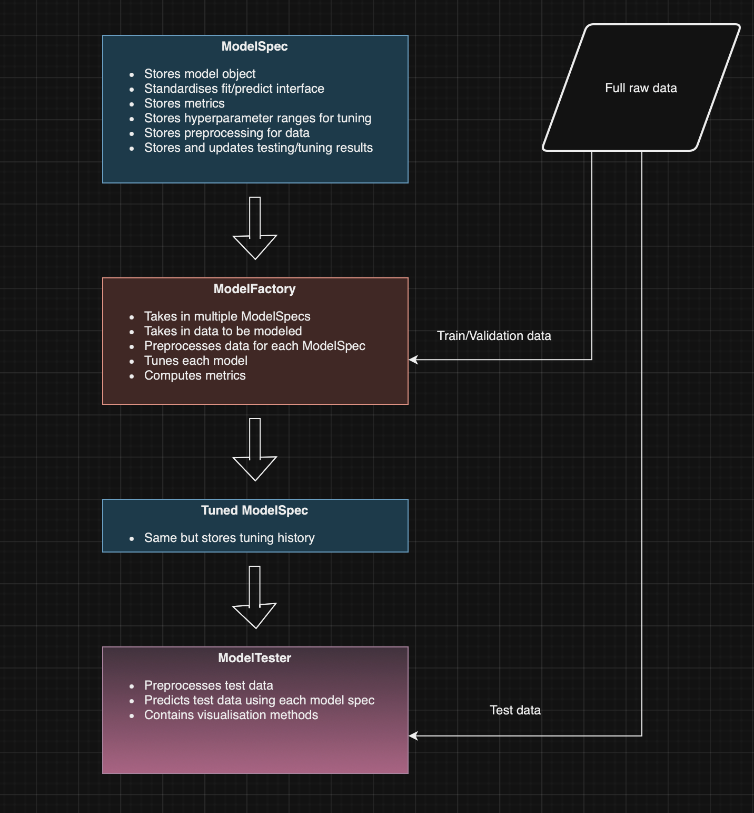

# ModelWorks

The process of making a good predictive model, can be split into three key stages:

1.  Data preprocessing
2.  Hyperparameter tuning
3.  Model evaluation

ModelWorks is a framework to connect these stages without loss of flexibility in each. It is compased of 3 components:

*   ModelSpec
*   ModelFactory
*   ModelTester

ModelSpec, is a class which stores information specific to an individual modelling process including preprocessing steps, hyperparameter constraints and performance metrics.

